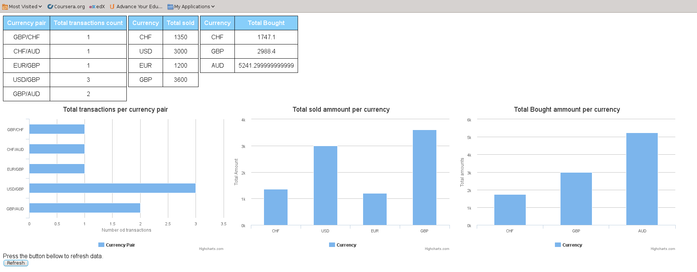

# Messager application

This is a test application for CurrencyFair. It accepts messages sent to `/p/receive` endpoint in JSON format 
and displays some statistics about them on index page.

Application is deployed to Heroku cloud infrastructure. Since it uses free tier, it's being put to sleep after certain period of inactivity. For that
reason, it is possible that first request to application be a few seconds slower until server wakes up, but after that it should function at normal speed.

#How to use
Applications accepts POST requests sent to `https://arcane-plains-1246.herokuapp.com/p/receive`, with message body in JSON format. To see the statistics of transactions,
visit application hme page at `https://arcane-plains-1246.herokuapp.com/index.html`. The statistics report looks something like this:

To refresh report data, click on _Refresh_ button in the bottom.
